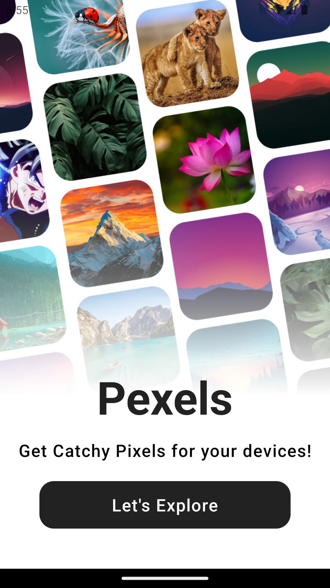
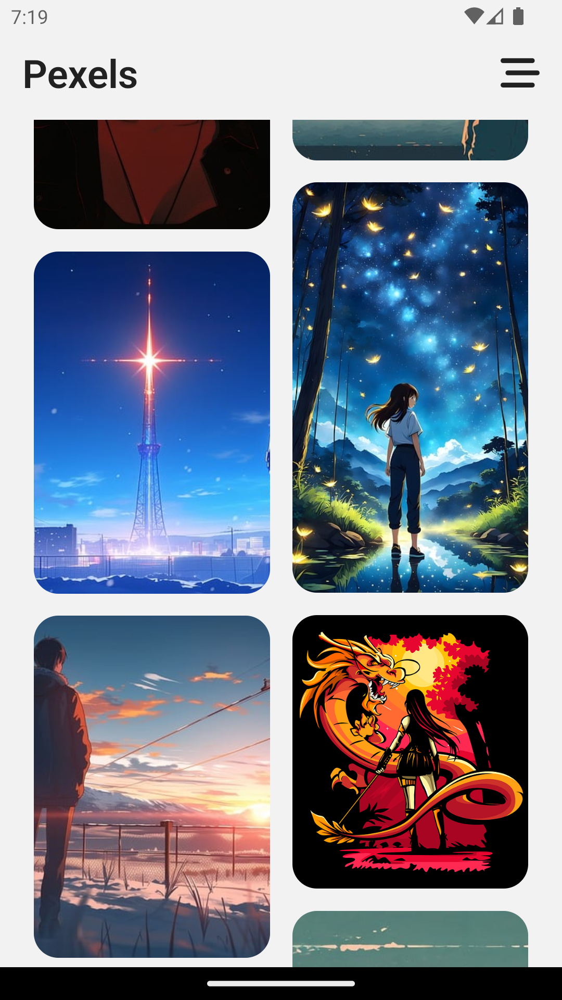
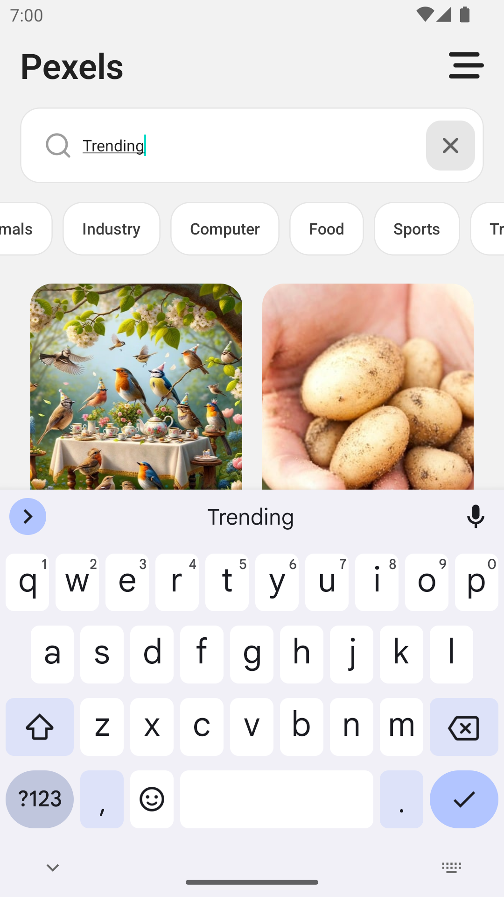
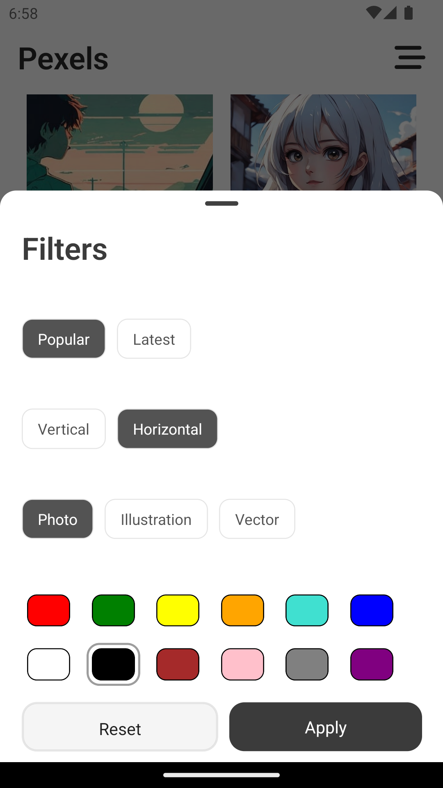

<Center>


</Center>

# Pexels - Your Mood, Your Wallpaper!

> ###### Pexels brings you fresh, stunning wallpapers every day. Perfectly tailored for any device, our app ensures you always have the latest and greatest background to match your style and mood."

## App Screenshots

<div style="display: flex; flex-direction: row; justify-content: flex-start; width:200px; height:250px; padding: 10px; gap:10px;">
  
  
  
  
  
</div>

## Features

- Splash Screen
- Routing via stacks
- Categories
- Searching
- Filters
  - Orientation
  - Popularity
  - Type
  - Color Scheme
- Modern Layout
- Modals for Filters
- Modals for Viewing Images
- Download
- Sharing
- Types
- Linted

## Tech Stack

#### Client:

- React Native (Expo)
- Animations (Re-Animated)
- Handful of Expo libs
- Typescript

#### Server:

- Nodejs
- Express
- Graphql
- Apollo Server
- Typescript

#### Database:

- Supabase (Postgresql)

## Wanna Run in your Machine?

Clone the project

```bash
  git clone https://github.com/ShahbaazX786/pexels.git
```

Go to the project directory

```bash
  cd pexels
```

Install dependencies

```bash
  npm install
```

Start the server

```bash
  npm run z
```

## Environment Variables

To run this project, you will need to add the following environment variables to your .env file. As we have used expo to initialize this app so prefixing EXPO\_ is the way to go if you want to utilize the .env file.

`EXPO_PUBLIC_API_KEY` - This is the pixabay API KEY

`EXPO_PUBLIC_API_URL` - This is the pixabay URL

## Feedback

##### If you have any feedback, please reach out to me in below ways:

- LinkedIn - https://www.linkedin.com/in/shaik-shahbaaz-alam/
- Github - Just Dm me or raise a PR.
- Twitter / X - https://twitter.com/shahbaazx24
- Email - shahbaazalam78@gmail.com

## Support

For support, you can star 🌟 this repo or follow me on my social handles.
